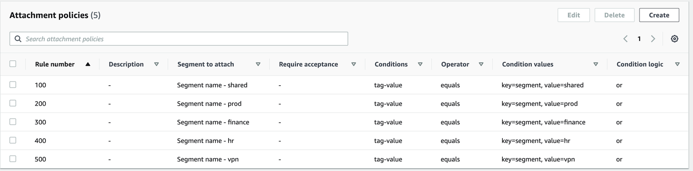

# Lab 3 - AWS Cloud WAN Core Network Policy 설정

### 1. Core Network Policy 변경

Network manager에서 Core Network > Policy version 메뉴를 선택합니다.

* **"Policy Version - 1"**&#xC744; 선택하고 **Edit**을 클릭합니다.

<figure><figcaption></figcaption></figure>

### **2. 네트워크 구성 편집**

\[!] 미리 만들어둔 Network Policy 파일(.json)을 다운로드 한뒤 policy view mode를  JSON mode로 변경하여 텍스트 붙여넣기로 Network Policy를 변경할 수 있습니다. 하지만, 세부 항목을 학습하기 위해서 JSON mode로 정책을 변경하지 않고 visual editor mode를 사용해서 정책 변경을 진행합니다. (설정 변경 없이 2.1로 이동)

* [ ] **샘플 파일 다운로드 -** [**policy.json**](https://www.dropbox.com/scl/fi/v5ug4lslvvo6kif6jvhsd/policy.json?rlkey=2r69oq6z7x6bqle690wwqpnab\&st=dpqgncbe\&dl=0)

<figure><figcaption></figcaption></figure>

#### 2.1 엣지 위치(Edge locations) 설정  - Visual Editor 사용

* policy view mode를 "Visual Editor"로 선택하고 Network configuration을 설정합니다.
* us-east-1 엣지의  ASN이 64512로 설정되어 있음을 확인하고 리전 엣지를 추가합니다. eu-central-1 은 64513로 , ap-southeast-1은 64514, ap-northeast-1은 64515로 새로운 에지를 추가합니다. 이때, ASN 번호는 Lab 5에서 on-prem vpn 연결 시 BGP peering을 위해 필요하기 때문에 정확하게 입력되어야합니다.
* 아래와 같이 4개의 리전에 엣지(CNE)의 ASN이 잘 설정되었는 지 다시 한번 확인합니다.&#x20;

<figure><figcaption></figcaption></figure>

#### 2.2 세그멘테이션 (Segments) 설정

* **세그먼트** 탭 을 클릭합니다.
* 기본 세그먼트로 생성된 Shared 이외에 prod, finance, hr 및 vpn 세그먼트를 추가합니다. 각 segment에 attach가 될 때 한번 더 확인 과정을 거치도록 "Require Acceptance"를 체크합니다.&#x20;
* 나머지 설정은 아래와 같이 기본값으로 선택합니다.&#x20;

<figure><figcaption></figcaption></figure>

#### 2.3 Segment action 설정

세그먼트 공유 작업은 세그먼트 라우팅 테이블 간에 경로를 누출(leaking)하거나 전파하는 데 사용됩니다.&#x20;

이번 랩에서는 Shared 와 VPN 세그먼트의 모든 경로가 다른 VPC로 전파하여 VPN 및 Shared 자원에 액세스할 수 있도록 합니다.

* **Segment action** 탭 을 클릭합니다.
* **Sharing** 섹션에서  **"Create"** 를 클릭 합니다 .
* 드롭다운 메뉴에서 **shared** 세그먼트 선택
* **공유 대상** 옵션 에서 "**allow all"** 을 선택하십시오 .
* **Create sharing** 클릭 합니다.

<figure><figcaption></figcaption></figure>

* **VPN** 세그먼트 에 대해 shared와 동일한 방법으로 생성합니다.
* shared와 vpn 세그먼트에 대한 공유 설정은 아래와 같은지 확인 후 다음 단계로 넘어갑니다.

<figure><figcaption></figcaption></figure>

#### 2.3 연결 정책(Attachment Policies) 설정

* Attachment 탭을 클릭하고 만들기 를 클릭합니다.
* shared 세그먼트 연결에 대한 attachment policy 생성
* 규칙 번호를 입력하고 각 attachment policy를 추가합니다.
* **세그먼트 이름**(Segment name)을 선택 하고 **작업** 섹션 아래의 드롭다운에서 연결할 세그먼트를 선택합니다.
* **연결 수락 옵션(**&#x41;ttachment acceptance options) 에서 **세그먼트 수락 값 상속(**&#x49;nherit segment's acceptance valu&#x65;**)** 을 선택 합니다.
* **조건 논리** 를 **OR** 로 둡니다.
* **조건** 섹션에서 유형을 **Tag Value**으로 설정하고 이 **세그먼트** 에 배치할 첨부 파일의 태그와 일치하는 값(key값은 **segment** , value는 **shared )**&#xC744; 입력합니다.
* **Create attachment policy**  클릭 합니다.

<figure><figcaption></figcaption></figure>

* **prod** , **finance** , **hr** 및 **vpn** 세그먼트 에 대해 위 작업을 반복합니다 .
* 각 세그먼트 연결 정책에 대해 **규칙 번호** 를 증가시키는 것을 잊지 마십시오.
* 최종 결과는 다음과 같아야 합니다.

<figure><figcaption></figcaption></figure>

#### 2.4 코어 네트워크 정책 생성&#x20;

코어 네트워크 정책을 생성하고 나면 변경 세트(change set)이 생성됩니다. 변경세트의 상태가 ready로 변경되면 해당 변경 세트를 배포할 수 있습니다.&#x20;

* 모든 구성이 올바른지 확인하고 나서 **정책 만들기를** 클릭 합니다.
* 새로운 정책 버전이 생성되는 데에는 몇분이 소요될 수 있으며, 변경 세트 상태 정보에서 현재 상태를 확인할 수 있습니다.
* 정책 생성이 완료된 후에는 상태가 "Ready to excute"로 표시 됩니다.
* 새 정책 버전이 준비된 것을 확인되면, 해당 버젼을 선택한 후 **View or apply change set** 을 클릭하여 관리자가 새로운 policy가 문제 없음을 확인한 뒤 실행할 수 있습니다.

<figure><figcaption></figcaption></figure>

* 최종 배포 이전에 "**Compare policy versions**"를 클릭하여 새로운 버젼과 기존 버젼과의 변경점을 확인하고난 뒤 "**Apply change set**"을 클릭하여 정책을 배포합니다.&#x20;

<figure><figcaption></figcaption></figure>

#### 2.4 변경 이벤트 확인

네트워크 정책의 배포에는 엣지 배포, 세그먼트, 경로 설정 여부 등에 따라서 소요 시간이 길어질 수 있으며, 배포포중에 상태 정보는 각 policy 버젼의 "Execution progress" 섹션에서 확인할 수 있습니다.

<figure><figcaption></figcaption></figure>

배포 과정을 포함한 모든 Cloud WAN Policy 변경 및 적용 이벤트는 CloudWatch로 보내지며, Network Manager의 이벤트 정보에서도 확인할 수 있습니다.

<figure><figcaption></figcaption></figure>

### Lab 3 체크리스트

* [ ] 다음에서 AWS Cloud WAN의 코어 네트워크 정책(Core Network Policy, CNP)에서 정의될 수 있는 항목이 아닌 것을 무엇인가요? \
  \- ASN 범위, 트렌짓 게이트웨어 피어링, CIDR 블럭, 엣지 로케이션, 세그먼트, 세그먼트 공유 정책,  세그먼트 라우팅 정책, 연결(Attachment 정책)
* [ ] AWS Cloud WAN에서 에지를 추가하거나 변경할 경우 어느 정도 시간이 소요되나요?
* [ ] AWS Cloud WAN에서 세그먼트 라우팅 정책을 변경할 경우 어느 정도 시간이 소요되나요?
* [ ] AWS Cloud WAN의 코어 네트워크 정책(Core Network Policy)이 아래와 같은지 확인합니다.

